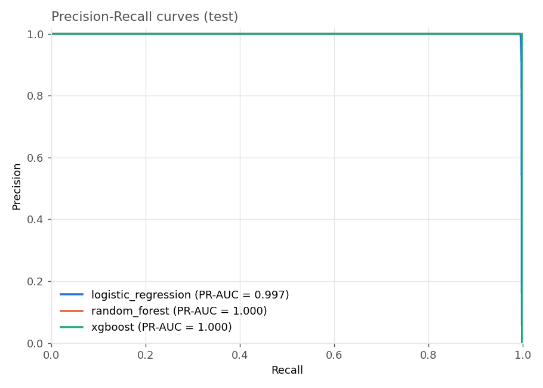
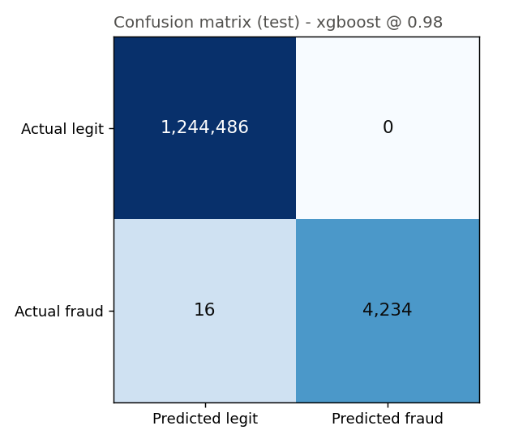
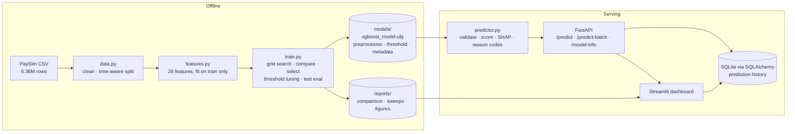
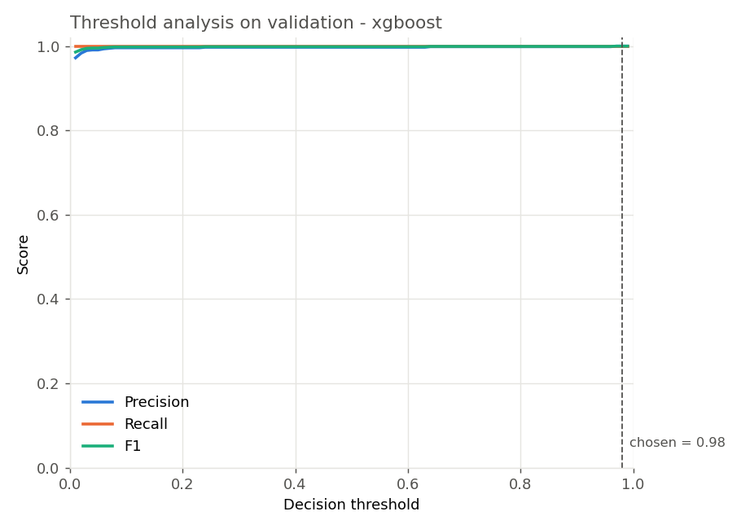
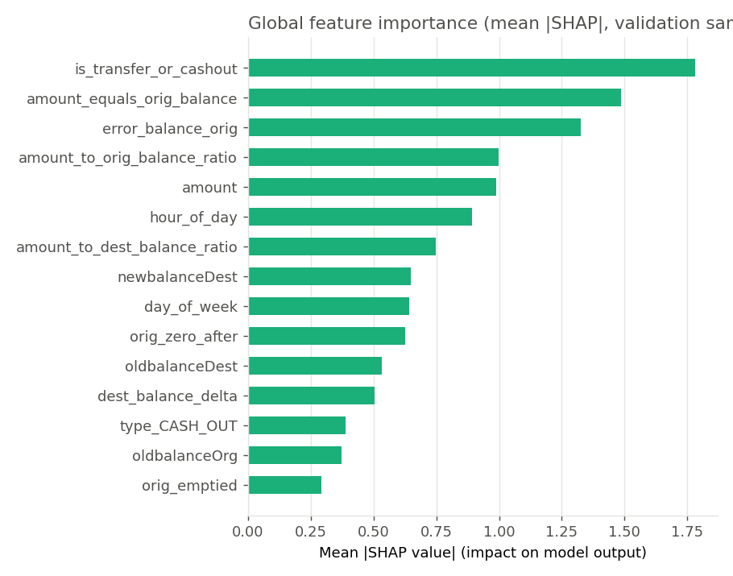

# FraudGuard — Explainable Transaction Fraud Detection

[](https://github.com/YOUR_GITHUB_USERNAME/fraudguard/actions/workflows/ci.yml)


An end-to-end fraud detection system for PaySim mobile-money transactions:
a **time-aware, leakage-safe pipeline** that compares Logistic Regression,
Random Forest and XGBoost, tunes the decision threshold on validation data,
explains every score with **SHAP**, and serves the result through a
**FastAPI** service and a **Streamlit** dashboard with a **SQLite** prediction
history — tested with **pytest**, containerised with **Docker Compose**, and
checked on every push by **GitHub Actions**.

> **Read the results with the dataset in mind.** PaySim is a *simulator*, and its
> fraud follows a mechanical pattern (the origin account is drained and the
> destination balance is not updated). Balance-reconciliation features expose
> that pattern almost perfectly, so every reasonable model scores near the
> ceiling. The ablation below quantifies exactly how much of the performance
> comes from those features. Real-world fraud is far noisier; treat these
> numbers as an upper bound, not a benchmark. See [Limitations](#limitations).

---

## Contents

- [Results at a glance](#results-at-a-glance)
- [Architecture](#architecture)
- [Dataset](#dataset)
- [Features](#features)
- [Model comparison and selection](#model-comparison-and-selection)
- [Threshold analysis](#threshold-analysis)
- [Feature ablation](#feature-ablation)
- [Explanations](#explanations)
- [Setup](#setup)
- [API](#api)
- [Dashboard](#dashboard)
- [Tests and CI](#tests-and-ci)
- [Docker](#docker)
- [Repository layout](#repository-layout)
- [Limitations](#limitations)

---

## Results at a glance

Deployed model: **XGBoost** (`max_depth=8`, `learning_rate=0.1`,
`scale_pos_weight=√(neg/pos)≈34.6`, 500 trees, early-stopped on validation
log-loss). Numbers below are from the **untouched test split** — the last 20 %
of the timeline (1,248,736 transactions, 4,250 fraud), never used for
training, model selection or threshold tuning.

| Metric | Value | In plain terms |
|---|---|---|
| Precision | **1.0000** | 0 false alarms in 1,248,736 transactions |
| Recall | **0.9962** | 4,234 of 4,250 frauds caught, 16 missed |
| F1 | **0.9981** | at the tuned threshold 0.98 |
| PR-AUC | **0.9999** | ranking quality across all thresholds |
| ROC-AUC | **1.0000** | |
| Accuracy | 0.99999 | reported for completeness only — a model that flags *nothing* scores 99.66 % here |

<p align="center">
  
  
</p>

---

## Architecture



Two services, one shared library (`src/fraudguard`):

- **API** (`api/`) — FastAPI with Pydantic validation, structured error
  responses, single and batch (CSV) scoring, SHAP explanations, and a
  persisted history.
- **Dashboard** (`dashboard/`) — Streamlit; talks to the API when it is
  reachable and falls back to in-process scoring otherwise.

---

## Dataset

[PaySim](https://www.kaggle.com/datasets/ealaxi/paysim1) simulates one month
(744 hourly steps) of mobile-money transactions.

| | |
|---|---|
| Rows | 6,362,620 |
| Fraud | 8,213 (0.129 %) — only in `TRANSFER` (4,097) and `CASH_OUT` (4,116) |
| Columns | `step`, `type`, `amount`, `oldbalanceOrg`, `newbalanceOrig`, `oldbalanceDest`, `newbalanceDest`, `nameOrig`, `nameDest`, `isFraud`, `isFlaggedFraud` |
| Cleaning | 0 duplicates, 0 missing values, 0 invalid types or negative amounts (the code handles all of these defensively) |
| Dropped | `nameOrig`/`nameDest` (unique IDs), `isFlaggedFraud` (a downstream business rule, not an input) |

**Time-aware split on `step`** (cut at whole hours, no hour shared between splits):

| Split | Steps | Rows | Fraud | Fraud rate |
|---|---|---|---|---|
| Train | 1 – 281 | 3,820,599 | 3,193 | 0.084 % |
| Validation | 282 – 355 | 1,293,285 | 770 | 0.060 % |
| Test | 356 – 743 | 1,248,736 | 4,250 | 0.340 % |

The test period's fraud rate is ~4× the training period's: legitimate traffic
thins out late in the simulation while fraud continues at a constant rate.
That is genuine distribution shift and one reason a chronological split is
more honest than a random one. `notebooks/01_eda.ipynb` walks through the data.

---

## Features

`features.engineer_features` adds 21 row-local features (no cross-row
aggregates, so nothing from the future can leak into a training row), plus a
one-hot `type` → **26 model features**. Absolute `step` is deliberately
excluded (test steps are always later than training steps).

| Group | Features |
|---|---|
| Amount | `amount`, `log_amount`, `amount_to_orig_balance_ratio`, `amount_to_dest_balance_ratio` |
| Balance movement | `orig_balance_delta`, `dest_balance_delta`, the four raw balances |
| **Reconciliation** | `error_balance_orig = newbalanceOrig + amount − oldbalanceOrg`, `error_balance_dest = oldbalanceDest + amount − newbalanceDest` |
| Flags | `orig_emptied`, `amount_equals_orig_balance`, `orig_zero_before/after`, `dest_zero_before/after`, `is_transfer_or_cashout` |
| Time | `hour_of_day`, `day_of_week` |

`amount_equals_orig_balance` is true for ~98 % of frauds and ~0 % of
legitimate transactions — the "drained account" signature.

Leakage guards: features are row-local; the preprocessor is fit on the
training split only; the target and `isFlaggedFraud` are never inputs;
thresholds and hyper-parameters are chosen on validation only; the test split
is scored exactly once.

---

## Model comparison and selection

Every model family gets the same treatment: a small hyper-parameter grid is
scored on **validation PR-AUC** (search on a 1M-row subsample of train, refit
of the best configuration on all 3.82M rows), then each model's decision
threshold is tuned on validation (max F1, midpoint of the F1 plateau).

| Model | Grid | Best configuration | Imbalance handling |
|---|---|---|---|
| Logistic Regression | `C ∈ {0.1, 1, 10}` | `C=1.0` | `class_weight="balanced"` |
| Random Forest | `max_depth ∈ {8,12,16}` × `min_samples_leaf ∈ {5,20}` | depth 12, leaf 5 | `class_weight="balanced_subsample"` |
| XGBoost | `max_depth ∈ {4,6,8}` × `learning_rate ∈ {0.05,0.1}` × `scale_pos_weight ∈ {1, √ratio}` | depth 8, lr 0.1, √ratio | `scale_pos_weight` (grid-searched) + early stopping on validation log-loss |

**Validation** (model selection):

| Model | PR-AUC | ROC-AUC | Tuned threshold | Precision | Recall | F1 | FP | FN |
|---|---|---|---|---|---|---|---|---|
| Logistic Regression | 0.9848 | 0.99999 | 0.99 | 0.7556 | 1.0000 | 0.8608 | 249 | 0 |
| Random Forest | 1.0000 | 1.0000 | 0.64 | 1.0000 | 1.0000 | 1.0000 | 0 | 0 |
| XGBoost | 1.0000 | 1.0000 | 0.98 | 1.0000 | 1.0000 | 1.0000 | 0 | 0 |

**Test** (reported once, after all decisions were made):

| Model | Precision | Recall | F1 | PR-AUC | ROC-AUC | FP | FN | Inference (ms / 100k rows) |
|---|---|---|---|---|---|---|---|---|
| Logistic Regression | 0.9998 | 0.9946 | 0.9972 | 0.9975 | 0.9983 | 1 | 23 | 23 |
| Random Forest | 1.0000 | 0.9979 | 0.9989 | 0.99999 | 1.0000 | 0 | 9 | 288 |
| **XGBoost** | 1.0000 | 0.9962 | 0.9981 | 0.9999 | 1.0000 | 0 | 16 | 883 |

**Selection rule** (fixed before training): highest validation PR-AUC (tie
tolerance 0.0005) → highest F1 at the tuned threshold → native SHAP support →
lowest latency. Random Forest and XGBoost tied on both metrics; XGBoost was
selected because it provides exact TreeSHAP explanations natively (no extra
explainer dependency in the service). On the test set Random Forest missed 9
frauds and XGBoost 16, with no false alarms from either — a difference of 7
transactions in 1.25M, within the noise of this dataset. All 21 search trials
are stored in `reports/model_comparison.json` and shown in the dashboard.

`python -m fraudguard.train --deploy random_forest` deploys a different model
by explicit decision; the automatic choice is always recorded alongside.

---

## Threshold analysis

The threshold is chosen on validation by maximising F1 and, when several
thresholds tie, taking the midpoint of the plateau (a knife-edge optimum is
fragile under drift). For the deployed model the plateau is 0.97 – 0.99 →
**0.98**.

The choice is a real trade-off, visible on the test set:

| Threshold | Precision | Recall | F1 | FP | FN |
|---|---|---|---|---|---|
| 0.50 (default) | 0.9998 | 0.9981 | 0.9989 | 1 | 8 |
| **0.98 (tuned)** | 1.0000 | 0.9962 | 0.9981 | 0 | 16 |

Zero false alarms cost 8 extra misses. Which side of that trade you want is
a business decision — the dashboard slider and the API's `threshold`
parameter let you make it at scoring time. `reports/threshold_analysis.csv`
has the full validation sweep.

<p align="center"></p>

---

## Feature ablation

Same XGBoost configuration trained three times (`scripts/ablation.py`):

| Feature set | # features | Test PR-AUC | Precision | Recall | FP | FN |
|---|---|---|---|---|---|---|
| Raw columns only (type, amount, balances, time) | 12 | 0.9734 | 0.9815 | 0.8489 | 68 | **642** |
| Without the 4 reconciliation features | 22 | 0.9998 | 0.9995 | 0.9866 | 2 | 57 |
| All engineered features | 26 | 0.9981 | 1.0000 | 0.9953 | 0 | 20 |

The engineered features are where the performance comes from: without them
the same model misses 642 frauds instead of 20.

---

## Explanations

SHAP values are computed with XGBoost's built-in TreeSHAP
(`Booster.predict(pred_contribs=True)` — the same algorithm as
`shap.TreeExplainer`, values in log-odds that sum to the model output). The
top contributions are translated into short reason codes.

Global importance (mean |SHAP| on a validation sample):
`is_transfer_or_cashout`, `amount_equals_orig_balance`, `error_balance_orig`,
`amount_to_orig_balance_ratio`, `amount`, `hour_of_day`, …

Example — a TRANSFER of 181 that empties the origin account:

```json
{
  "fraud_probability": 0.999974,
  "is_fraud": true,
  "threshold": 0.98,
  "risk_level": "HIGH",
  "explanation": {
    "top_features": [
      {"feature": "amount_equals_orig_balance", "value": 1.0, "shap_value": 12.9358, "direction": "increases_fraud_risk"},
      {"feature": "error_balance_orig",         "value": 0.0, "shap_value": 3.8962,  "direction": "increases_fraud_risk"},
      {"feature": "amount",                     "value": 181.0, "shap_value": -1.4281, "direction": "decreases_fraud_risk"}
    ],
    "reasons": [
      "Amount equals the full origin balance",
      "Origin balances do not reconcile with the amount",
      "Origin balance is zero after the transaction"
    ],
    "base_value": -4.5939
  }
}
```

<p align="center"></p>

---

## Setup

```bash
git clone https://github.com/YOUR_GITHUB_USERNAME/fraudguard.git
cd fraudguard
python -m venv .venv && source .venv/bin/activate      # Windows: .\.venv\Scripts\Activate.ps1
pip install -r requirements-dev.txt
pip install -e .
```

The trained model (`models/`) and reports ship with the repository, so the
API and dashboard work immediately. To retrain:

1. Download PaySim from Kaggle (`scripts/download_data.py` with a Kaggle
   token, or manually) into `data/raw/PS_20174392719_1491204439457_log.csv`.
2. `python -m fraudguard.data` — clean and split (~1 min, needs ~4 GB RAM).
3. `python -m fraudguard.train` — search, compare, select, evaluate
   (~30 min on 4 cores; ~65 min on Colab's free CPU tier).
4. Optional: `python scripts/ablation.py`, `python scripts/build_eda_notebook.py`.

`notebooks/02_colab_train.ipynb` runs steps 1 – 3 on Google Colab if your
machine is short on memory.

---

## API

```bash
uvicorn api.main:app --port 8000      # interactive docs at http://localhost:8000/docs
```

| Method | Path | Purpose |
|---|---|---|
| GET | `/health` | liveness, model and database status |
| GET | `/model-info` | model type, features, threshold, validation/test metrics |
| POST | `/predict` | score one transaction, optional SHAP explanation and threshold override |
| POST | `/predict-batch` | score a CSV upload (multipart), per-row results and summary |
| GET | `/history`, `/history/stats` | stored predictions |

```bash
curl -X POST http://localhost:8000/predict -H "Content-Type: application/json" -d '{
  "transaction": {"step": 300, "type": "TRANSFER", "amount": 181,
                  "oldbalanceOrg": 181, "newbalanceOrig": 0,
                  "oldbalanceDest": 0, "newbalanceDest": 0},
  "threshold": null, "explain": true, "top_n": 5
}'

curl -X POST "http://localhost:8000/predict-batch?explain=true" \
     -F "file=@data/samples/sample_transactions.csv"
# {"summary": {"rows": 525, "flagged": 27, "flag_rate": 0.0514, "threshold": 0.98, ...}, "results": [...]}
```

Invalid input returns a structured `422`:

```json
{"error": "validation_error",
 "detail": [{"loc": ["body", "transaction", "type"], "msg": "Input should be 'CASH_IN', 'CASH_OUT', 'DEBIT', 'PAYMENT' or 'TRANSFER'", ...},
            {"loc": ["body", "transaction", "amount"], "msg": "Input should be greater than or equal to 0", ...}]}
```

---

## Dashboard

```bash
streamlit run dashboard/app.py       # http://localhost:8501
```

| Page | What it does |
|---|---|
| Overview | test metrics, how the model was chosen, dataset caveats |
| Score a transaction | form → decision, probability, reason codes, SHAP contribution chart |
| Batch scoring | CSV upload → flagged rows, score distribution, download of the scored CSV; shows TP/FP/FN when the file has an `isFraud` column |
| Model performance | validation/test comparison, all search trials, interactive threshold analysis, SHAP importance, saved figures |
| Prediction history | everything stored in SQLite, filterable, downloadable |

The sidebar slider changes the decision threshold for scoring and for the
threshold-analysis chart.

<p align="center">
  
</p>
<p align="center">
  
  
</p>

---

## Tests and CI

```bash
pytest            # 55 tests, ~10 s
ruff check .
```

The suite trains a small model on a **synthetic PaySim-like dataset**
(`tests/synthetic.py`), so it runs anywhere — including CI — without the
470 MB download. It covers cleaning and the chronological split, feature
logic and leakage guards, metric and threshold-selection maths (including the
plateau rule), the predictor (single vs batch consistency, threshold
overrides, input validation), SHAP additivity (contributions + base value
reproduce the model's log-odds), reason codes, the SQLite store, and every API
endpoint including invalid inputs and CSV edge cases.

`.github/workflows/ci.yml` runs lint + tests on Python 3.10 and 3.11 on every
push and pull request, then builds both Docker images and smoke-tests the API
container (`/health` and a `/predict` call).

---

## Docker

```bash
docker compose up --build
# API:       http://localhost:8000/docs
# Dashboard: http://localhost:8501
```

Two images (`api/Dockerfile`, `dashboard/Dockerfile`) built from the same
source; the prediction history lives in a named volume so it survives
restarts. The dashboard reaches the API at `http://api:8000` inside the
compose network. Configuration is via environment variables
(`FRAUDGUARD_MODELS_DIR`, `FRAUDGUARD_DATABASE_URL`, `FRAUDGUARD_API_URL`).

For a single-host deployment, put a reverse proxy (nginx, Caddy) in front of
the two ports; for a platform such as Render, Railway or Cloud Run, deploy the
two images as separate services and set `FRAUDGUARD_API_URL` on the dashboard.

---

## Repository layout

```
fraudguard/
├── api/                  FastAPI service (main.py, schemas.py, Dockerfile)
├── dashboard/            Streamlit app (app.py, utils.py, Dockerfile)
├── src/fraudguard/       library: config, data, features, evaluate, train, explain, predictor, db
├── tests/                pytest suite + synthetic data generator
├── scripts/              download_data, ablation, notebook builders, screenshot capture
├── notebooks/            01_eda.ipynb (executed), 02_colab_train.ipynb
├── models/               trained artifacts (xgboost_model.ubj, preprocessor, threshold, metadata)
├── reports/              metrics JSON/CSV, figures, screenshots
├── data/samples/         525-row sample from the test split for batch demos
├── .github/workflows/    CI
├── docker-compose.yml · Makefile · pyproject.toml · requirements*.txt
```

---

## Limitations

- **Synthetic data.** PaySim's fraud is generated by rules; the
  reconciliation features capture those rules directly, which is why
  precision is 1.0 and PR-AUC ≈ 0.9999. On real transactions the same
  pipeline would score far lower, and features built on account history and
  network structure would matter far more.
- **Ceiling effects make model selection noisy.** Random Forest and XGBoost
  are separated by 7 transactions out of 1.25M; the ranking could flip with a
  different seed. The selection rule and both models' numbers are reported so
  the choice is auditable.
- **Narrow operating plateau for the deployed model** (0.97 – 0.99).
  Class-weighted boosting pushes probabilities towards 1, so the tuned
  threshold is high and sensitive to drift; the unweighted variant has a
  wider plateau but a marginally lower PR-AUC. Monitoring the score
  distribution in production would be essential.
- **No account-level or graph features.** Each transaction is scored alone;
  velocity features and transaction-graph features are the obvious next step
  on real data.
- **SQLite history** is fine for a single instance, not for a horizontally
  scaled service.

---

## License

MIT — see [LICENSE](LICENSE).
